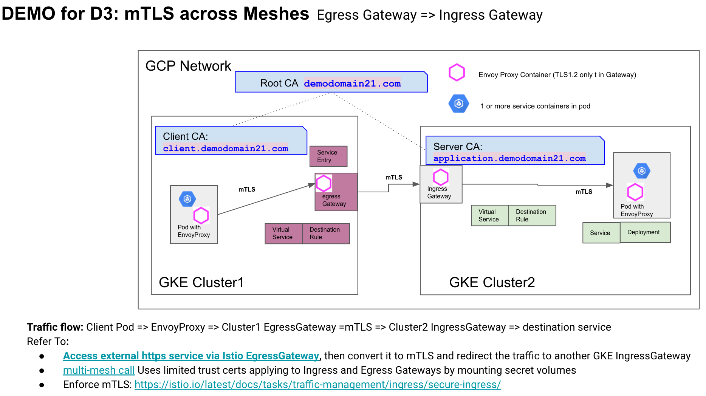
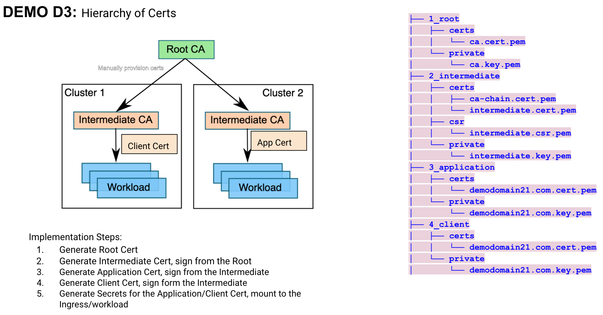

# Setup mTLS Mesh-to-Mesh on GKE 
Tested versions: Istio V1.8.1 and Kubernetes V1.17

### Prereqs

* kubectl
* jq

### Instructions
* Successfully tested mTLS from the Client GKE cluster to the Server Cluster with the above listed versions
* Use Istio Egress Gateway to manage the outgoing traffic from the Client cluster, with ServiceEntry, DestinationRule, VirtualService.
* Use Intermediate certs instead of Root certs
* Traffic flow: Http request from the test pod without cert => EnvoyProxy => Cluster1 EgressGateway = mTLS => Cluster2 IngressGateway => destination service
* The traffic flow goes into the Server Cluster: Istio Ingress Gateway => Virtual Service => Destination Rule => Envoy Proxy => Target pod

### References:
* Build https Ingress-Egress-Ingress Gateways across 2 Istio meshes: https://istio.io/latest/blog/2020/proxying-legacy-services-using-egress-gateways/
* Istio Ingress Gateway: https://istio.io/latest/docs/tasks/traffic-management/ingress/
* Inspired from below posts:
  * Tatt Turner's video Cross-Cluster Calls: https://www.youtube.com/watch?v=FiMSr-fOFKU
  * Step by step script from the above video: https://github.com/mt165/cross-cluster-calls-istio-1-1-kubecon-eu-19
  * Setup http traffic from Egress Gateway to Ingress Gateway https://github.com/crcsmnky/istio-egress-gateway

### Architecture: Traffic flow across 2 clusters



### Assumptions:
* Cluster-to-Cluster traffic is routed securely over the internet between public IPs
* Use NodePort IP as Ingress Host if don't have public IP for the server cluster

## Implementation Steps:

### Generate new set of certs with Intemdiate cert
Refer to: certs/generate-certs/README.md



### Create 2 GKE clusters: cluster1 as client, cluster2 as server (upstream)
GKE version 1.17

Refer to 01-build-gke.md

### Initiate and setup Istio 1.8.1 without Helm on both clusters

NOTE: We just use Istio Default profile which doesn't install EgressGateway in namespace istio-system. Because we'll install a dedicated EgressGateway in namespace httpbin by IstioOperator at Step 07.

See the details at: 
```
02-init-istio-1.8.1.md
03-create-certs.sh
04-setup-istio-1.8.1.md
```
### Create simple Igress Gateway, virtualservice on cluster2 as destination
See the details at below guide, also refer to: https://istio.io/latest/docs/tasks/traffic-management/ingress/secure-ingress/
```
05-deploy-app.md
06-build-ingress-mtls.md
```


### Create Egress Gateway, virtualservice on cluster1 as client
See the details at below guide, also refer to: https://istio.io/latest/blog/2020/proxying-legacy-services-using-egress-gateways/
```
07-mtls-egress-gw.md
```
NOTES for EgressGateway: 
* Make sure to follow the above guide to install a dedicated EgressGateway in namespace httpbin by IstioOperator, this is the key step to make the egress work.
* If you don't want to build such dedicated EgressGateway, you could also leverage any existing one if it's already deployed, say in namespace istio-system using Istio Demo profile. Refer to `07x-mtls-egress-gw-local-k8s.yaml` for the detailed configuration.


### Additional Notes:

* You can see graph of traffic flow via kiali if used Istio Demo profile, it doesn't exist in default profile
```
istioctl dashboard kiali  # login admin admin
```


### TODO:
* Test filter and destination rule to revoke client access
* Test CRL to revoke client access
* Seek automation solution to rotate/distribute the certs like Vault
